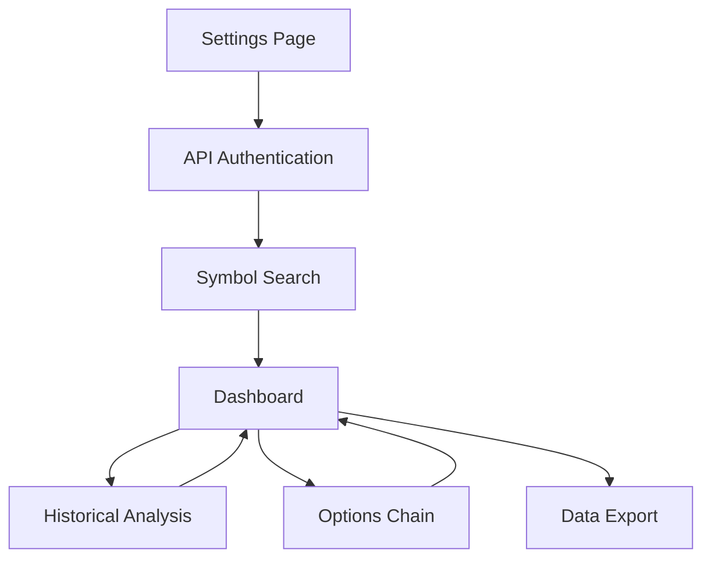

# TrueData Live Data Solution - Product Requirements Document

## 1. Product Overview
A real-time financial data solution that provides live market data, historical analysis, and options trading insights for individual stock symbols using TrueData APIs. The platform enables traders and analysts to monitor real-time price movements, analyze historical trends, and make informed trading decisions with comprehensive market data for symbols like Reliance.

## 2. Core Features

### 2.1 User Roles
| Role | Registration Method | Core Permissions |
|------|---------------------|------------------|
| Trader | TrueData API credentials | Full access to real-time data, historical analysis, options data |
| Analyst | TrueData API credentials | Read-only access to all data and analytics features |

### 2.2 Feature Module
Our TrueData live data solution consists of the following main pages:
1. **Dashboard**: Real-time price display, live charts, key metrics summary
2. **Historical Analysis**: Historical price charts, bar data visualization, trend analysis
3. **Options Chain**: Live options data with Greeks calculations, strike price analysis
4. **Symbol Search**: Symbol master integration, search and selection interface
5. **Settings**: API configuration, data refresh intervals, display preferences

### 2.3 Page Details
| Page Name | Module Name | Feature description |
|-----------|-------------|---------------------|
| Dashboard | Live Price Display | Show real-time LTP, bid/ask prices, volume data with auto-refresh |
| Dashboard | Live Chart | Display real-time candlestick charts with configurable timeframes |
| Dashboard | Key Metrics | Show daily high/low, change percentage, trading volume |
| Historical Analysis | Price Charts | Visualize historical bar data with multiple timeframe options (1min, 5min, daily, etc.) |
| Historical Analysis | Tick Data Viewer | Display detailed tick-by-tick price movements for selected time periods |
| Historical Analysis | Data Export | Export historical data in CSV format for external analysis |
| Options Chain | Live Options Data | Display real-time options prices for all strikes and expiries |
| Options Chain | Greeks Calculator | Show Delta, Gamma, Theta, Vega calculations for each option |
| Options Chain | Strike Analysis | Highlight ITM/OTM options with profit/loss indicators |
| Symbol Search | Symbol Master | Search and select from complete symbol database with filters |
| Symbol Search | Symbol Details | Display company information, ISIN, tick size, circuit limits |
| Settings | API Configuration | Configure TrueData API credentials and connection settings |
| Settings | Data Preferences | Set refresh intervals, chart types, notification preferences |

## 3. Core Process

**Main User Flow:**
1. User configures TrueData API credentials in Settings
2. System authenticates with TrueData OAuth endpoint
3. User searches and selects a symbol (e.g., RELIANCE) from Symbol Search
4. Dashboard displays real-time data with live updates
5. User can navigate to Historical Analysis for trend analysis
6. User can view Options Chain for derivatives trading insights
7. System maintains live connection with automatic reconnection on failures

## 4. User Interface Design

### 4.1 Design Style
- **Primary Colors**: Dark theme with #1a1a1a background, #00ff88 for positive values, #ff4444 for negative values
- **Secondary Colors**: #333333 for cards, #666666 for borders, #ffffff for text
- **Button Style**: Rounded corners (8px), gradient backgrounds, hover effects
- **Font**: Inter font family, 14px base size, 16px for headers, 12px for data tables
- **Layout Style**: Card-based layout with responsive grid system, fixed top navigation
- **Icons**: Feather icons for consistency, financial symbols for market data

### 4.2 Page Design Overview
| Page Name | Module Name | UI Elements |
|-----------|-------------|-------------|
| Dashboard | Live Price Display | Large price cards with color-coded changes, real-time updating numbers |
| Dashboard | Live Chart | TradingView-style candlestick charts with zoom controls and timeframe selector |
| Dashboard | Key Metrics | Compact metric cards in grid layout with icons and trend indicators |
| Historical Analysis | Price Charts | Full-width chart area with sidebar controls, date range picker |
| Historical Analysis | Tick Data Viewer | Scrollable data table with fixed headers, search and filter options |
| Options Chain | Live Options Data | Tabular layout with alternating row colors, sortable columns |
| Options Chain | Greeks Calculator | Tooltip displays with detailed calculations, color-coded risk indicators |
| Symbol Search | Symbol Master | Search bar with autocomplete, filterable results grid |
| Settings | API Configuration | Form layout with secure input fields, connection status indicators |

### 4.3 Responsiveness
Desktop-first design with mobile-adaptive breakpoints at 768px and 1024px. Touch-optimized controls for mobile devices with larger tap targets and swipe gestures for chart navigation.