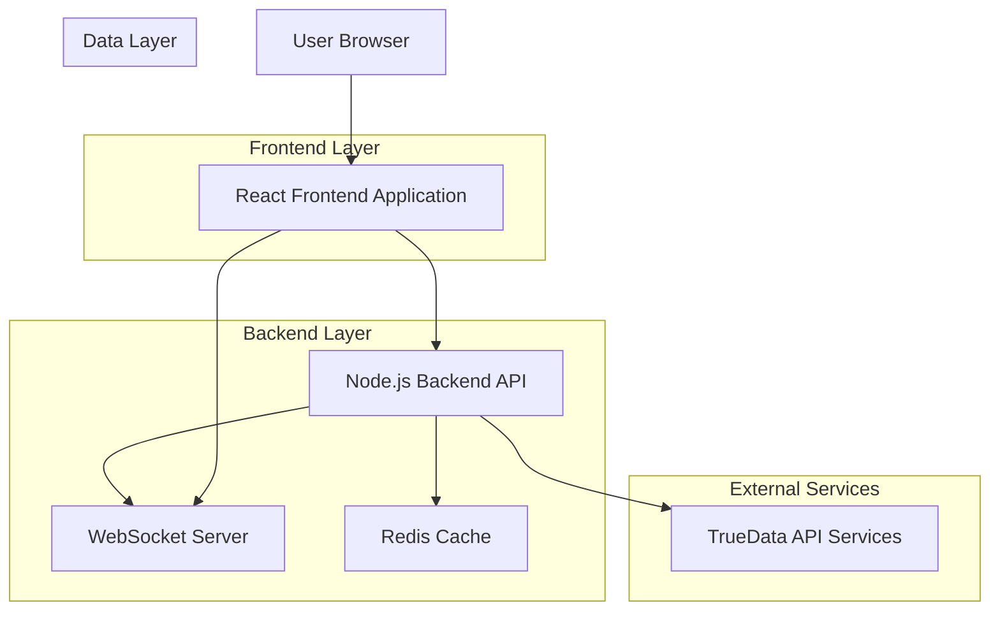
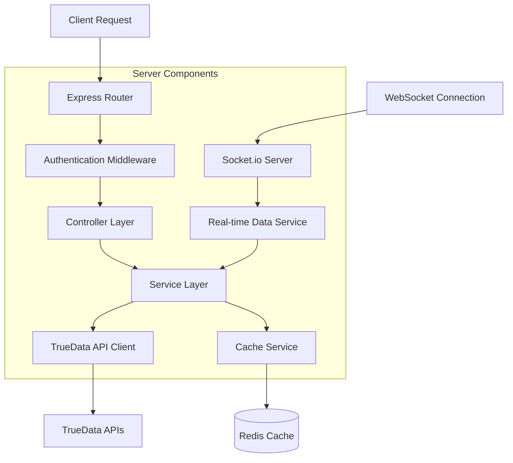
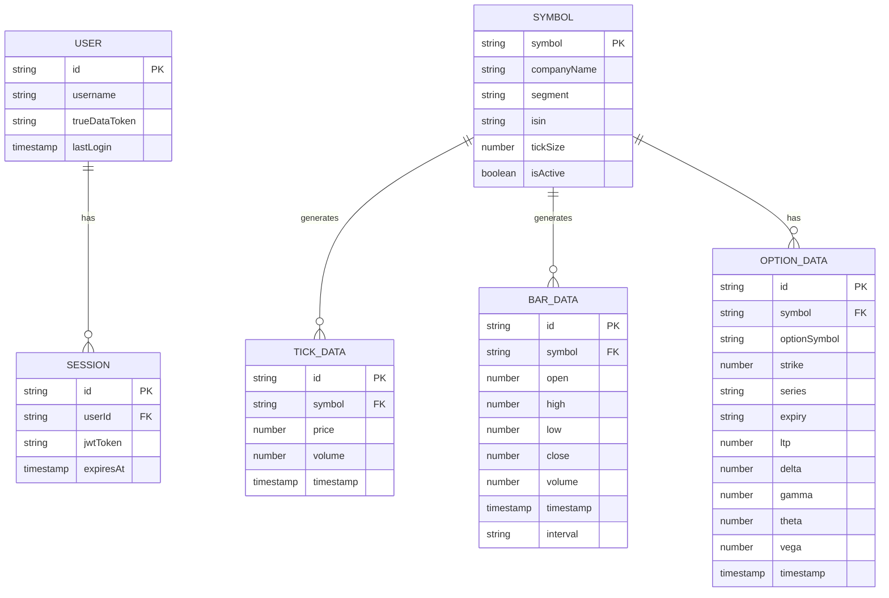

# TrueData Live Data Solution - Technical Architecture Document

## 1. Architecture Design



## 2. Technology Description
- Frontend: React@18 + TypeScript@5 + Vite + TailwindCSS@3 + Recharts + Socket.io-client
- Backend: Node.js@20 + Express@4 + TypeScript@5 + Socket.io + Redis + Axios
- Cache: Redis@7 for real-time data caching and session management
- External APIs: TrueData REST APIs for authentication and data retrieval

## 3. Route Definitions
| Route | Purpose |
|-------|---------|
| / | Dashboard page with real-time data display for selected symbol |
| /historical | Historical analysis page with charts and tick data |
| /options | Options chain page with Greeks calculations |
| /search | Symbol search and selection interface |
| /settings | API configuration and user preferences |

## 4. API Definitions

### 4.1 Core API

**Authentication**
```
POST /api/auth/login
```

Request:
| Param Name | Param Type | isRequired | Description |
|------------|------------|------------|-------------|
| username | string | true | TrueData username |
| password | string | true | TrueData password |

Response:
| Param Name | Param Type | Description |
|------------|------------|-------------|
| success | boolean | Authentication status |
| token | string | JWT token for session |
| trueDataToken | string | TrueData API access token |

**Symbol Data**
```
GET /api/symbols/search
```

Request:
| Param Name | Param Type | isRequired | Description |
|------------|------------|------------|-------------|
| query | string | false | Search term for symbol |
| segment | string | false | Market segment (eq/fo/mcx) |
| limit | number | false | Maximum results (default: 50) |

Response:
| Param Name | Param Type | Description |
|------------|------------|-------------|
| symbols | Symbol[] | Array of matching symbols |
| total | number | Total available symbols |

**Real-time Data**
```
GET /api/data/ltp/:symbol
```

Request:
| Param Name | Param Type | isRequired | Description |
|------------|------------|------------|-------------|
| symbol | string | true | Symbol name (e.g., RELIANCE) |

Response:
| Param Name | Param Type | Description |
|------------|------------|-------------|
| symbol | string | Symbol name |
| ltp | number | Last traded price |
| change | number | Price change |
| changePercent | number | Percentage change |
| volume | number | Trading volume |
| timestamp | string | Data timestamp |

**Historical Data**
```
GET /api/data/bars/:symbol
```

Request:
| Param Name | Param Type | isRequired | Description |
|------------|------------|------------|-------------|
| symbol | string | true | Symbol name |
| from | string | true | Start date (YYMMDDTHH:MM:SS) |
| to | string | true | End date (YYMMDDTHH:MM:SS) |
| interval | string | false | Bar interval (1min, 5min, eod) |

Response:
| Param Name | Param Type | Description |
|------------|------------|-------------|
| bars | BarData[] | Array of OHLCV data |
| symbol | string | Symbol name |
| interval | string | Data interval |

**Options Chain**
```
GET /api/options/chain/:symbol
```

Request:
| Param Name | Param Type | isRequired | Description |
|------------|------------|------------|-------------|
| symbol | string | true | Underlying symbol |
| expiry | string | false | Expiry date (DD-MM-YYYY) |

Response:
| Param Name | Param Type | Description |
|------------|------------|-------------|
| options | OptionData[] | Array of options with Greeks |
| underlyingPrice | number | Current underlying price |
| expiry | string | Expiry date |

## 5. Server Architecture Diagram



## 6. Data Models

### 6.1 Data Model Definition



### 6.2 Data Definition Language

**Redis Cache Structures**

```javascript
// Real-time price cache
const ltpKey = `ltp:${symbol}`;
const ltpData = {
    symbol: 'RELIANCE',
    ltp: 2450.50,
    change: 25.30,
    changePercent: 1.04,
    volume: 1250000,
    timestamp: '2024-01-15T10:30:00Z',
    ttl: 5 // seconds
};

// Historical data cache
const barsKey = `bars:${symbol}:${interval}:${date}`;
const barsData = {
    symbol: 'RELIANCE',
    interval: '1min',
    bars: [
        {
            timestamp: '2024-01-15T09:15:00Z',
            open: 2425.00,
            high: 2430.00,
            low: 2420.00,
            close: 2428.50,
            volume: 15000
        }
    ],
    ttl: 300 // 5 minutes
};

// Options chain cache
const optionsKey = `options:${symbol}:${expiry}`;
const optionsData = {
    symbol: 'RELIANCE',
    expiry: '25-01-2024',
    underlyingPrice: 2450.50,
    options: [
        {
            strike: 2400,
            series: 'CE',
            ltp: 75.50,
            delta: 0.65,
            gamma: 0.002,
            theta: -0.15,
            vega: 0.25
        }
    ],
    ttl: 10 // seconds
};

// Symbol master cache
const symbolsKey = 'symbols:master';
const symbolsData = {
    symbols: [
        {
            symbol: 'RELIANCE',
            companyName: 'Reliance Industries Limited',
            segment: 'EQ',
            isin: 'INE002A01018',
            tickSize: 0.05,
            lotSize: 1
        }
    ],
    ttl: 3600 // 1 hour
};

// Authentication token cache
const authKey = `auth:${userId}`;
const authData = {
    trueDataToken: 'bearer_token_string',
    expiresAt: '2024-01-15T18:00:00Z',
    ttl: 28800 // 8 hours
};
```

**TypeScript Interfaces**

```typescript
interface Symbol {
    symbol: string;
    companyName: string;
    segment: 'EQ' | 'FO' | 'MCX';
    isin: string;
    tickSize: number;
    lotSize?: number;
    isActive: boolean;
}

interface TickData {
    symbol: string;
    price: number;
    volume: number;
    timestamp: string;
    bidPrice?: number;
    askPrice?: number;
}

interface BarData {
    symbol: string;
    timestamp: string;
    open: number;
    high: number;
    low: number;
    close: number;
    volume: number;
    interval: string;
}

interface OptionData {
    symbol: string;
    optionSymbol: string;
    strike: number;
    series: 'CE' | 'PE';
    expiry: string;
    ltp: number;
    delta: number;
    gamma: number;
    theta: number;
    vega: number;
    timestamp: string;
}

interface LiveDataUpdate {
    type: 'ltp' | 'tick' | 'bar' | 'option';
    symbol: string;
    data: TickData | BarData | OptionData;
    timestamp: string;
}
```